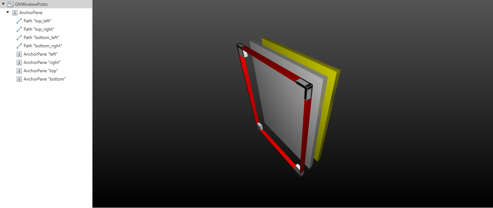
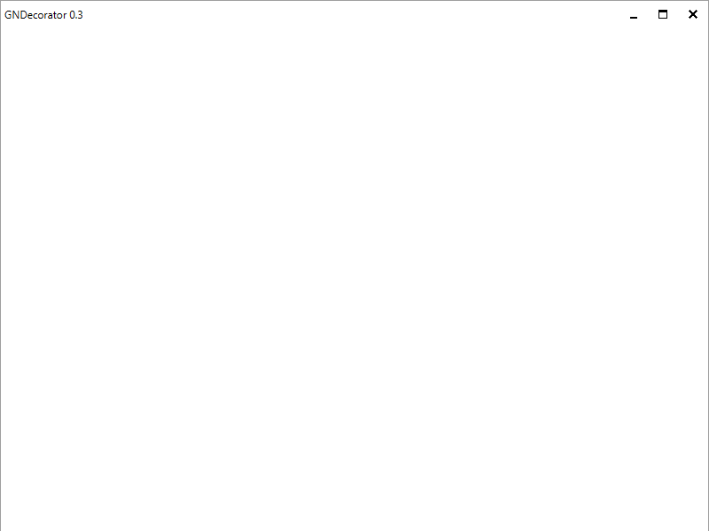
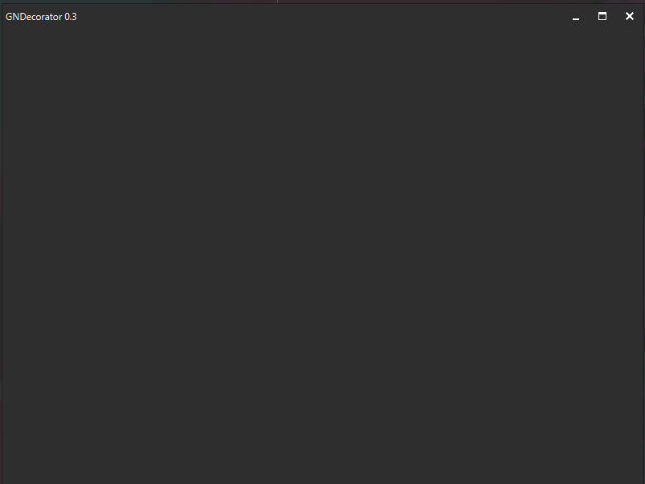
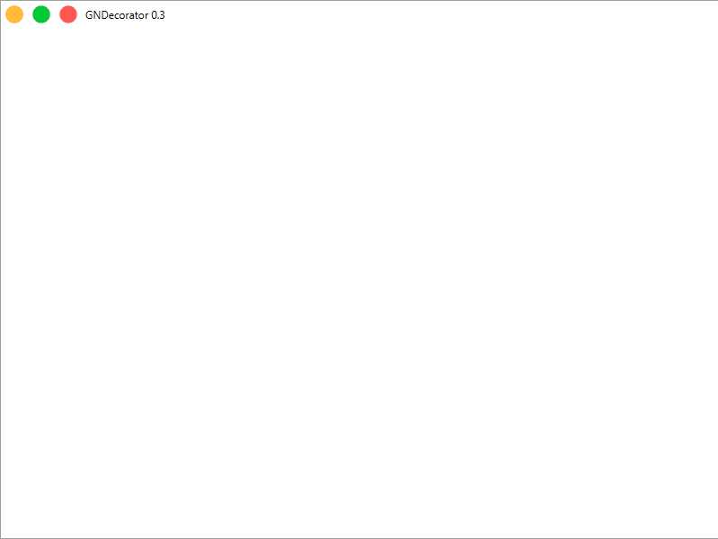

<h1 align="center">GNDecorator</h1>
<h6 align="center"> This project is part of the set of custom components created for JavaFx. </h6>
<h1></h1>

[](https://central.sonatype.dev/artifact/io.github.gleidsonmt/gndecorator/2.1.25)
[](https://github.com/gleidsonmt/GNDecorator/releases/tag/2.1.25)

[](https://github.com/gleidsonmt/GNDecorator/blob/master/LICENSE)

<p align="center">
  
</p>

# 📑 Contents

<!-- TOC -->
* [📑 Contents](#-contents)
* [💻 Environment](#-environment)
* [🚀 Installing Decorator](#-installing-decorator)
* [☕ Using Decorator](#-using-decorator)
* [🧬  Basic Structure](#-basic-structure)
  * [Structure - by Scenic View](#structure---by-scenic-view)
    * [Default Structure](#default-structure)
        * [View Default](#view-default)
        * [View Darkula](#view-darkula)
* [📺 On Youtube](#-on-youtube)
* [🛠 Enhancements](#-enhancements)
* [📫 Contributing to Project](#-contributing-to-project)
* [😄 Be a contritubutor<br>](#-be-a-contritubutor-br)
* [📝 License](#-license)
<!-- TOC -->

# 💻 Environment


This lib is a compnent for JavaFx:   Get in the offical website [JavaFx](https://openjfx.io/), Tutorial [Getting Started](https://openjfx.io/openjfx-docs/)

I have a great workstation here, then I've using a gradle 7.2 and Java and JavaFx +16 on Windows. (I really want to test in other systems in future).


# 🚀 Installing Decorator

Now you have many ways to get that!
!🗒️Note ** The release has the first changes I made and releases in nexus are more stable 🥸***

👌In code blocks find the copy button... is cooler, it automatically knows if your target is a pom.xml or gradle.build

For installing decorator, you have this options:

* For Pros - Click on the badge release or click badge nexus on the top of this document, and you're going to redirect to hosted sources.
* For Github Users - On the right side, you can see the packages and releases, click on them and download it, in case you are in packages just copy them into your build file.
* For Faster users - Just copy and paste the code bellow

If you use maven add in pom.xml:
```xml
<dependency>
  <groupId>io.github.gleidsonmt</groupId>
  <artifactId>gndecorator</artifactId>
  <version>2.2.25</version>
</dependency>
```

.. or in gradle.build:
```groovy
    implementation 'io.github.gleidsonmt:replaceVersionInREADME:2.2.25'
```

# ☕ Using Decorator

Begin to use... Java Code!

```java
  GNDecorator decorator = new GNDecorator();
  decorator.setTitle("JavaFx Application");
  decorator.setContent(content);
  decorator.fullBody() // the content occupies all of size
    
 // Adding menus 
  Menu menu = new Menu("File");
  menu.getItems().add(new MenuItem("Open"));
  menu.getItems().add(new MenuItem("Close"));
  decorator.addMenu(menu);
  decorator.addMenu(1, menu);// add with a index
        
  // Adding custom controls
  ButtonTest a1 = new ButtonTest("Button 1");
  decorator.addControl(a1);
  decorator.addControl(index, a1); // add with a index
  ```


# 🧬  Basic Structure

        root -> SstackPane
                body -> AnchorPane
                        top_left -> Path
                        top_right -> Path -- rotation 90°
                        bottom_left -> Path -- rotation 270°
                        bottom_right -> Path -- rotation 180°


## Structure - by Scenic View


### Default Structure


##### View Default

##### View Darkula

##### With gradient and image


# 📺 On Youtube
Short Presentation
[here](https://youtu.be/hZsYU7UbWmU)

# 🛠 Enhancements

Next steps:

- [x] Add Yosemite Theme
- [ ] Add Windows Theme
- [ ] The decoratorTheme in blank to customize
- [ ] Public methods to update window icons with css.
- [X] Better pratices for one class receives state scope event (Clean Code)
- [ ] Default Property to change bar height
- [ ] Float options (css too)

# 📫 Contributing to Project
<!---Se o seu README for longo ou se você tiver algum processo ou etapas específicas que deseja que os contribuidores sigam, considere a criação de um arquivo CONTRIBUTING.md separado--->
To contributing to project, follow these steps:

1. Fork this repository.
2. Creates a branch: `git checkout -b <branch_name>`.
3. Do your changes and commit: `git commit -m '<commit_message>'`
4. Send a branch to origin: `git push origin GNDecorator / <local>`
5. Creates pull request.

However, if you don't know [How to create a pull Request](https://help.github.com/en/github/collaborating-with-issues-and-pull-requests/creating-a-pull-request).

# 😄 Be a contritubutor<br>

🤖I really need more friends.. Send me a  <a href='mailto:gleidisonmt@gmail.com?subject=Hi, I see you need my help!.. I am here.'> email <a/>.

# 📝 License

This project is under license. See the file [LICENSE](LICENSE.md) to more details.

[⬆ Back to the top](#GNDecorator)<br>
