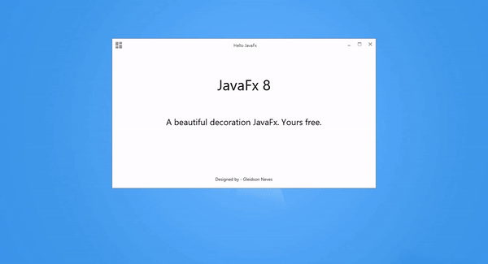
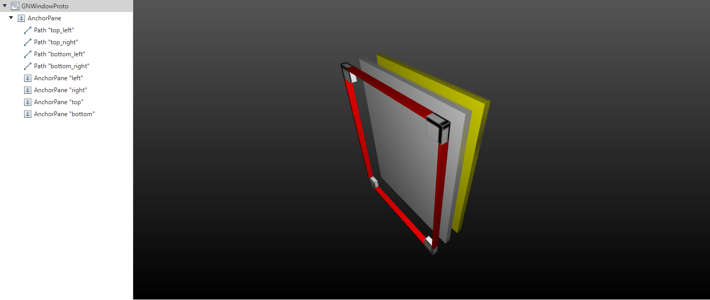

## GNDecorator is a simple decoration project for javaFx applications.

### Adaptable when the bar is moved

### Full Screen animation

### In production

#### Basic decoration

### Darkula

### With gradient and image

# Estrutura - Nodes

        root -> SstackPane
                body -> AnchorPane
                        top_left -> Path
                        top_right -> Path -- rotation 90°
                        bottom_left -> Path -- rotation 270°
                        bottom_right -> Path -- rotation 180°

# Estrutura - Objetos

        GNWindowProto - Fornece um protótipo inicial como um modelo para sua implementação personalizada |
        GNWindowBar   - Fornece um protótipo inicial com uma barra de ferramentas basica

## Primary Structure

# Structure - by Scenic View
## Primary

# Features
* Shadow  
        Decoração com sombra (É possivel fazer, porém no caso do windows causa lentidaão na gui), mais no caso do linux parace não haver essa lentidão.
        Em caso de janelas pequenas utilize, exemplo decoration.setShadow(true);

# Bugs
* Cursor não aparece bem por causa do espaço limitado dentro do path no node. (porém não inpede nada só é chato) :D;
