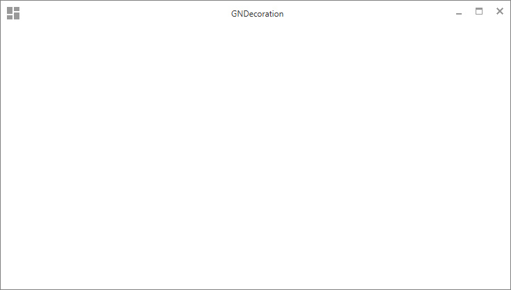
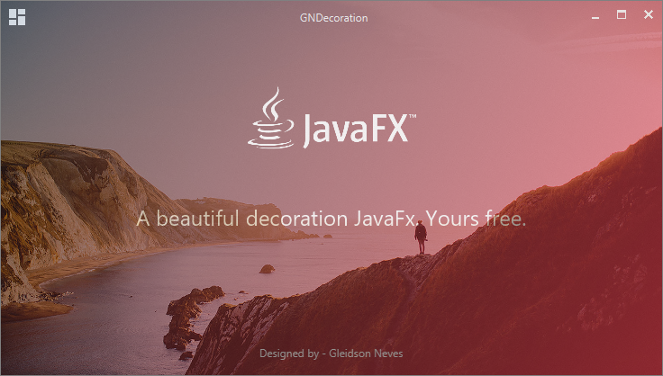

[](https://github.com/Gleidson28/GNCarousel/releases/tag/1.0)
[](https://github.com/Gleidson28/GNCarousel/blob/master/LICENSE) 

<h1></h1>

<p align="center">
  
</p>

<h1></h1>
<h6 align="center"> This project is part of the set of custom components created for JavaFx. </h6>

<h1></h1>

<h1>GNDecorator</h1>

<h5 > 
  GNDecorator is a simple decoration project for javaFx applications.
</h5>


 
##### View Default

##### View Darkula

##### With gradient and image


### Adaptable when the bar is moved

### Full Screen animation


# Basic structure 

        root -> SstackPane
                body -> AnchorPane
                        top_left -> Path
                        top_right -> Path -- rotation 90°
                        bottom_left -> Path -- rotation 270°
                        bottom_right -> Path -- rotation 180°


## Structure - by Scenic View


### Full Screen animation


 > Constrotors
 
```java
  GNDecorator decorator = new GNDecorator();
 ```

 > Setting content
```java
    decorator.setContent(content);
    decorator.fullBody() // the content occupies all of size
    decorator.floatActions(); // the controls are float
  ```

 > Menus
```java
    Menu menu = new Menu("File");
    menu.getItems().add(new MenuItem("Open"));
    menu.getItems().add(new MenuItem("Close"));
    decorator.addMenu(menu);
    decorator.addMenu(1, menu);// add with a index
  ```

 > Tittle
```java
    decorator.setTitle("JavaFx Application");
    decorator.centralizeTitle(); // Centralize
  ```

 > Controls
```java
    ButtonTest a1 = new ButtonTest("Button 1");
    decorator.addMenu(a1);
    decorator.addMenu(index, a1); // add with a index
  ```