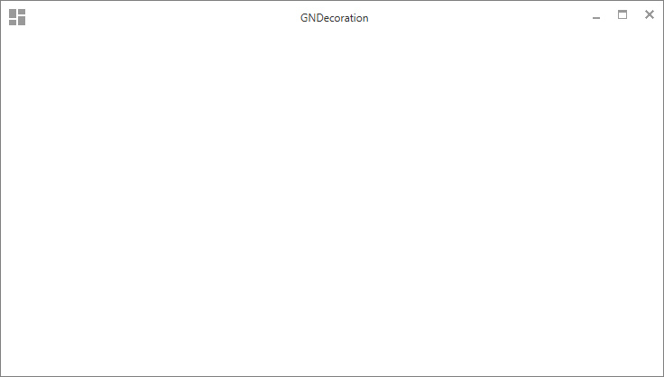

[](https://github.com/Gleidson28/GNCarousel/releases/tag/1.0)
[](https://github.com/Gleidson28/GNCarousel/blob/master/LICENSE) 

<h1></h1>

<p align="center">
  
</p>

<h1></h1>
<h6 align="center"> This project is part of the set of custom components created for JavaFx. </h6>

<h1></h1>

<h1>GNDecorator</h1>

<h5 > 
  GNDecorator is a simple decoration project for javaFx applications.
</h5>

 > Create a custom view for nodes.
 
```java
  GNDecorator window = new GNDecorator();
  window.setContent(root);
  window.initTheme(GNDecorator.Theme.DARKULA);
  window.setIcon(icon);
  window.setTitle("Title");
 ```
 
##### View Default

##### View Darkula

##### With gradient and image


### Adaptable when the bar is moved

### Full Screen animation


# Basic structure 

        root -> SstackPane
                body -> AnchorPane
                        top_left -> Path
                        top_right -> Path -- rotation 90°
                        bottom_left -> Path -- rotation 270°
                        bottom_right -> Path -- rotation 180°


## Structure - by Scenic View


