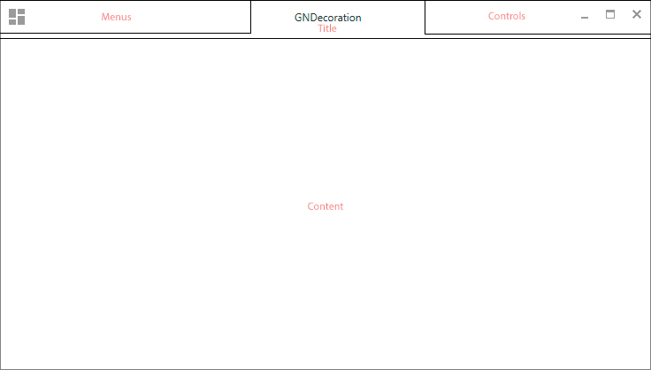

<h1 align="center">GNDecorator</h1>
<h6 align="center"> This project is part of the set of custom components created for JavaFx. </h6>
<h1></h1>

[](https://github.com/gleidsonmt/GNDecorator/releases/tag/2.1.25)
[](https://github.com/gleidsonmt/GNDecorator/releases/tag/2.1.25)
[](https://github.com/gleidsonmt/GNDecorator/blob/master/LICENSE) 

<p align="center">
  
</p>

# 📑 Contents

<!-- TOC -->

  * [🚀 Installig Decorator](#-installig-decorator)
* [🧬  Basic Structure](#-basic-structure)
  * [Structure - by Scenic View](#structure---by-scenic-view)
    * [Default Structure](#default-structure)
        * [View Default](#view-default)
        * [View Darkula](#view-darkula)
        * [With gradient and image](#with-gradient-and-image)
  * [📺 On Youtube](#-on-youtube)
    * [🛠 Ajustes e melhorias](#-ajustes-e-melhorias)
  * [📫 Contribuindo para <nome_do_projeto>](#-contribuindo-para--nome_do_projeto-)
  * [😄 Seja um dos contribuidores<br>](#-seja-um-dos-contribuidores-br)
  * [📝 Licença](#-licena)
<!-- TOC -->


# 🚀 Installing Decorator

For installing decorator, follow this steps:

Now you have many ways to get that!.
Note ** Release has the first changes I made ***

1. Pro - Click on the badge release or click badge nexus, and you're going to redirect to hosted sources.
2. Novice - 


If you use maven:
```
<dependency>
  <groupId>io.github.gleidsonmt</groupId>
  <artifactId>gndecorator</artifactId>
  <version>2.1.25</version>
</dependency>
```

.. or gradle:
```
    implementation 'io.github.gleidsonmt:gndecorator:2.1.25'
```

```java
  GNDecorator decorator = new GNDecorator();
 ```

> Setting content
```java
    decorator.setContent(content);
    decorator.fullBody() // the content occupies all of size
  ```

> Menus
```java
    Menu menu = new Menu("File");
    menu.getItems().add(new MenuItem("Open"));
    menu.getItems().add(new MenuItem("Close"));
    decorator.addMenu(menu);
    decorator.addMenu(1, menu);// add with a index
  ```

> Tittle
```java
    decorator.setTitle("JavaFx Application");
  ```

> Controls
```java
    ButtonTest a1 = new ButtonTest("Button 1");
    decorator.addControl(a1);
    decorator.addControl(index, a1); // add with a index
  ```


# 🧬  Basic Structure 

        root -> SstackPane
                body -> AnchorPane
                        top_left -> Path
                        top_right -> Path -- rotation 90°
                        bottom_left -> Path -- rotation 270°
                        bottom_right -> Path -- rotation 180°


## Structure - by Scenic View


### Default Structure



##### View Default

##### View Darkula

##### With gradient and image


## 📺 On Youtube
[Apresentation](https://youtu.be/hZsYU7UbWmU)

### 🛠 Ajustes e melhorias

Next steps:

- [x] Add Yosemite Theme
- [x] Public methods to update window icons.
- [ ] Code outside the scope


Adicione comandos de execução e exemplos que você acha que os usuários acharão úteis. Fornece uma referência de opções para pontos de bônus!

## 📫 Contribuindo para <nome_do_projeto>
<!---Se o seu README for longo ou se você tiver algum processo ou etapas específicas que deseja que os contribuidores sigam, considere a criação de um arquivo CONTRIBUTING.md separado--->
Para contribuir com <nome_do_projeto>, siga estas etapas:

1. Bifurque este repositório.
2. Crie um branch: `git checkout -b <nome_branch>`.
3. Faça suas alterações e confirme-as: `git commit -m '<mensagem_commit>'`
4. Envie para o branch original: `git push origin <nome_do_projeto> / <local>`
5. Crie a solicitação de pull.

Como alternativa, consulte a documentação do GitHub em [como criar uma solicitação pull](https://help.github.com/en/github/collaborating-with-issues-and-pull-requests/creating-a-pull-request).

## 😄 Seja um dos contribuidores<br>

Quer fazer parte desse projeto? Clique [AQUI](CONTRIBUTING.md) e leia como contribuir.

## 📝 Licença

Esse projeto está sob licença. Veja o arquivo [LICENÇA](LICENSE.md) para mais detalhes.

[⬆ Voltar ao topo](#nome-do-projeto)<br>
